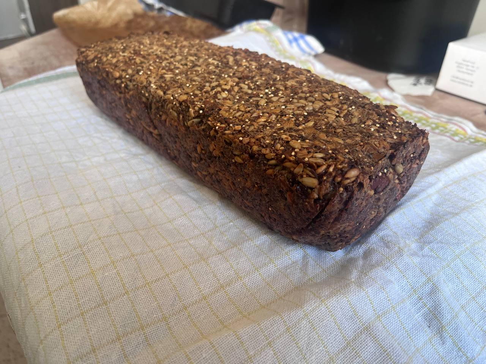

Dieses Brot ist ein wahres Kraftpaket!  
Es enthält viele wichtige Nährstoffe und Ballaststoffe. Dadurch macht es für lange Zeit satt.
Das Brot enthält weder Ei noch Mehl und ist somit für eine vegane und glutenfreie Ernährung geeignet.

Das Brot ist außerdem viel länger haltbar, als herkömmliches Brot und somit super für unterwegs geeignet.

Die Zubereitung ist kinderleicht und benötigt nur einen Backofen und eine Brotbackform.

Also keine weiteren Ausreden, und ab in die Küche!



Zutaten:
- 135g Sonnenblumenkerne
- 90g Leinsamen (gemahlen)
- 65g Haselnüsse oder andere Nüsse
- 145g Haferflocken
- 2 EL Chiasamen
- 4 EL Flohsamenschalen (gemahlen)
- 1 TL Salz
 
 Alle Zutaten in einer Schüssel gut mischen dann dazugeben: 
 
- 1 EL Ahornsirup
- 3 EL (Raps-)Öl
- 350mL warmes Wasser

Gut durchmischen, es dürfen keine trockenen Zutaten mehr da sein.

In eine mit Backpapier ausgelegte Kastenform füllen und fest reindrücken.  
Das Backpapier über dem Teig zusammenfalten, damit dieser während dem Ruhen nicht austrocknet. 

Dann mindestens für 2 Stunden oder über Nacht ruhen/quellen lassen.

Bei 175 Grad Ober/Unterhitze 45min backen.  
Dann aus der Form nehmen und erneut für 45min backen.

  

